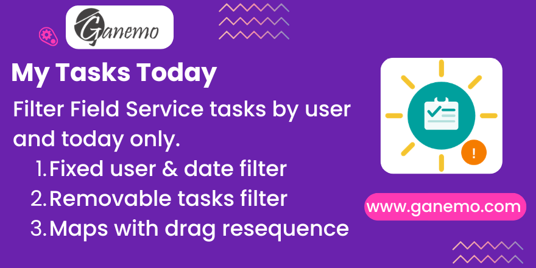

# **FSM My Tasks Today**

## Overview

**FSM My Tasks Today** is an Odoo 19 module for Field Service teams that adds a focused **"My Tasks Today"** menu entry as the first item under **My Tasks** in the Field Service application. When technicians open Field Service, they immediately see only their own tasks scheduled for today — nothing more, nothing less.

This module solves three common pain points in the native FSM *My Tasks → Tasks* view:

1. **Performance** – Removing the user filter caused slow loads with large task datasets.
2. **Future tasks noise** – The native view shows future tasks alongside today's, creating a cluttered view.
3. **Completed tasks clutter** – Done and cancelled tasks kept appearing, making it hard to focus on pending work.

---

## Features

| Feature | Behavior |
|---|---|
| **Fixed User Filter** | Always shows only the logged-in user's tasks, defined at the action domain level (non-removable by the user) |
| **Fixed Today Filter** | Restricts to tasks where `planned_date_begin < today+1d` AND `date_deadline >= today` — non-removable |
| **Active Tasks Filter** | Default search filter excluding `1_done` and `1_canceled` states — **removable** by the user with the ✕ button |
| **First Menu Position** | Placed at `sequence=5` under *My Tasks*, so it's the default view when entering Field Service |
| **Map View with Resequence** | The Map view sorts tasks by `sequence` field and allows drag-and-drop reordering |
| **Full View Matrix** | All native FSM views available: Kanban, List, Map, Calendar, Gantt, Form, Graph, Pivot, Activity |
| **Bilingual** | English + Spanish translations included (`i18n/es.po`) |

---

## Compatibility

- **Odoo Version**: 19.0 (Enterprise, Odoo.SH, Ganemo Online)
- **Required Modules**: `industry_fsm`, `project_enterprise`
- **NOT compatible** with Odoo Online (custom module restrictions)

---

## Installation

1. Copy the `fsm_my_tasks_today` folder into your Odoo addons path.
2. Enable **Developer Mode** in Odoo Settings.
3. Go to **Settings → Apps → Update Apps List**.
4. Search for **"FSM My Tasks Today"** and click **Install**.

---

## Usage

### Accessing the View
Navigate to **Field Service → My Tasks**. The first submenu **"My Tasks Today"** (or *"Mis Tareas Hoy"* in Spanish) loads automatically.

### Understanding the Filters

Upon loading, you will see **one filter chip** in the search bar:
- 🟣 **Active Tasks** *(removable)* — Hides tasks with status `Done` or `Cancelled`.

The following filters are **invisible but always active** (defined in the action domain):
- The view only shows **tasks assigned to you** (`user_ids in [your user]`).
- The view only shows **tasks for today** (`planned_date_begin < today+1d` and `date_deadline >= today`).

### Removing the Active Tasks Filter
Click the **✕** on the *Active Tasks* chip to see all your tasks for today, including completed and cancelled ones.

### Map View — Resequencing Tasks
1. Switch to the **Map** view.
2. Tasks are ordered by the `sequence` field (lowest first), then by `planned_date_begin`.
3. Drag the **⠿ handle** next to each task row in the map sidebar to reorder your daily route.

---

## Configuration

No configuration is required. The module works out of the box. The filters are hard-coded at the action level to ensure consistency and prevent accidental modification.

---

## FAQ

**Q: Why can't I remove the "My Tasks" or "Today" filter?**
A: These are applied at the domain level of the action (not as search filters), so they are permanent for this specific menu. Use the native **My Tasks → Tasks** menu if you need more flexibility.

**Q: Does this affect the native "My Tasks → Tasks" menu?**
A: No. This module creates a completely independent action, views, and menu item. Native menus are not modified.

**Q: Can a manager see other users' tasks in this view?**
A: No. The domain is always `user_ids in [uid]` (the current user). This view is intentionally personal. Managers should use **All Tasks** for cross-user visibility.

**Q: What happens if I have no tasks today?**
A: The empty state message "No tasks found for today!" is displayed.

---

## Technical Details

- **No Python models** — purely declarative XML module.
- **New `ir.actions.act_window`** (`project_task_action_fsm_today`) with fixed domain.
- **New search view** (`project.task.search.fsm.today`) inheriting from `industry_fsm.project_task_view_search_fsm`.
- **New map view** (`project.task.view.map.fsm.today`) inheriting from `industry_fsm.project_task_map_view_fsm_my_task` with `allow_resequence="true"`.
- No `ir.model.access.csv` needed (no new models).

---

## Author

**Author**: [Ganemo](https://www.ganemo.co)

**Maintainer**: Ganemo | **License**: OPL-1 | **Price**: See Odoo App Store

© 2026 Ganemo. All rights reserved.
